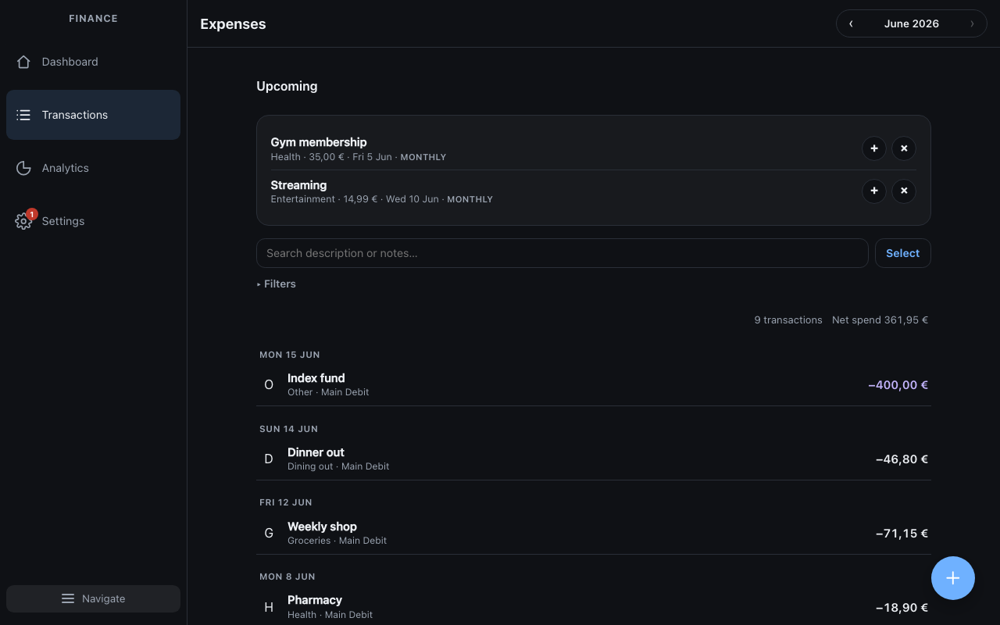
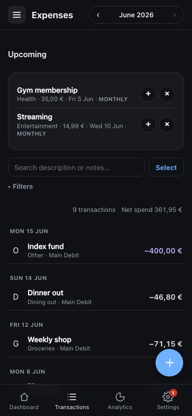
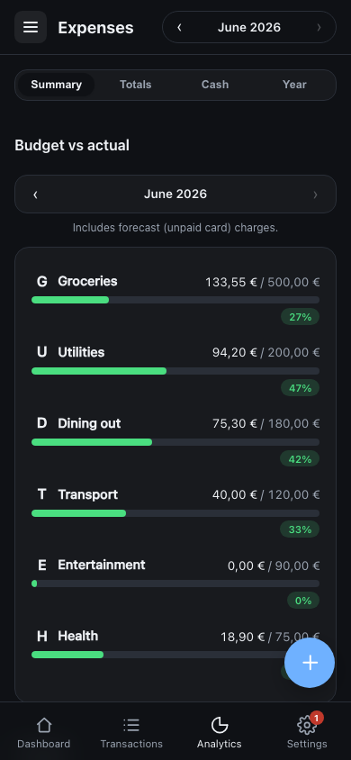
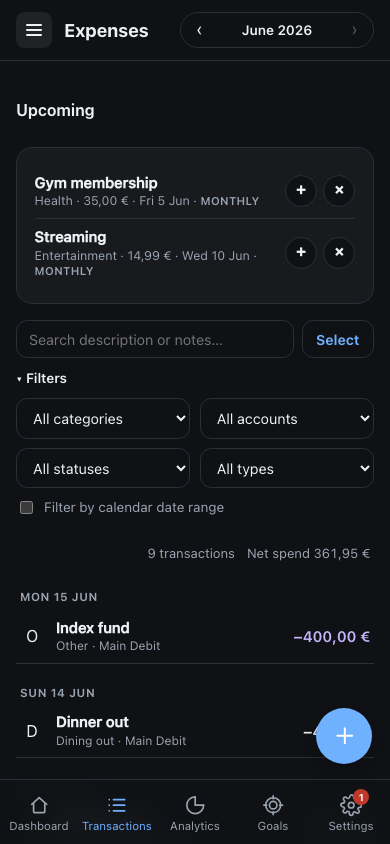
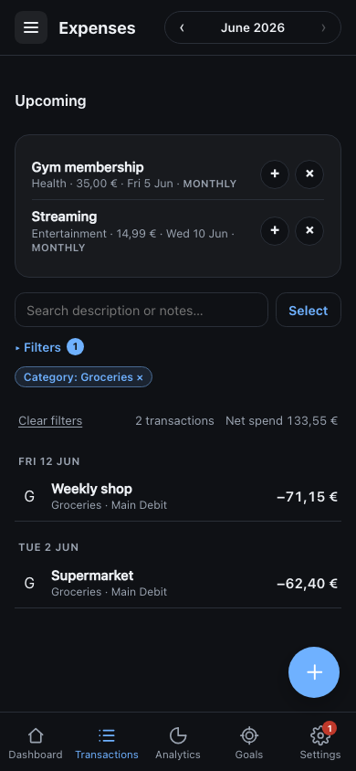
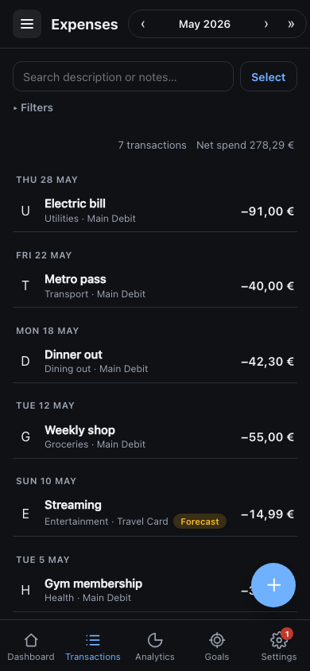
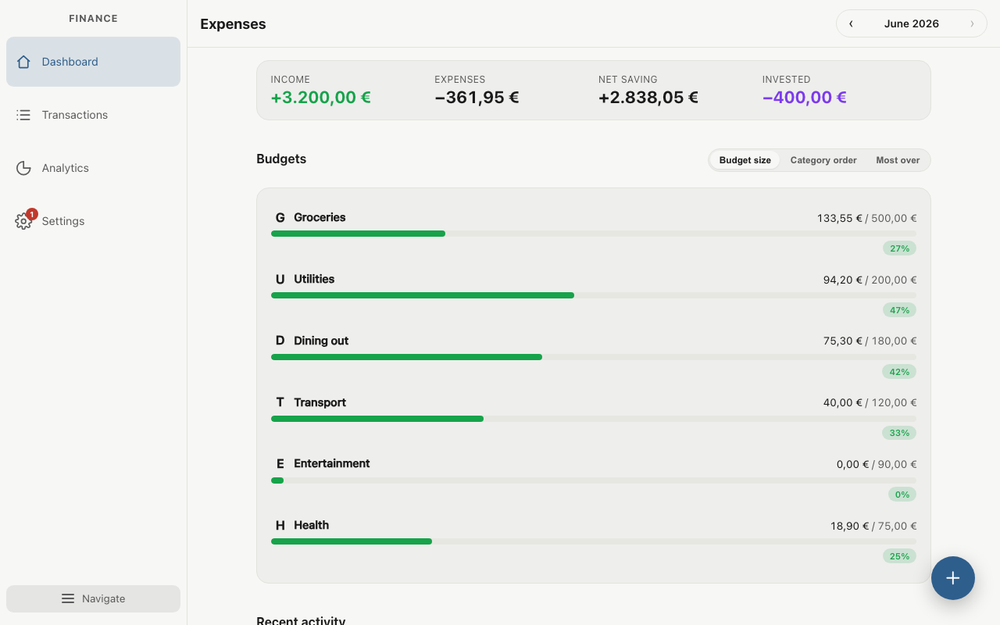

# Expense tracker

Personal budget and transaction tracker. A live instance runs at **https://expenses.crivolotti.com** (Cloudflare Access + D1 allowlist — authentication does not mean access; the owner approves users in-app).

- **Cloudflare Access** (Google sign-in) — who can authenticate
- **D1 allowlist + in-app admin** — who can use the app (`/access/admin`)
- **Row-level tenancy** — each user's data is scoped by email in D1

Shared UI: [`folio-shell`](https://github.com/RoyCrivolotti/folio-shell) on [npm](https://www.npmjs.com/package/folio-shell) (`folio-shell@^1.0.1`).

## Screenshots

Fixture data (`fixtures/demo-expenses.csv`). Access admin and Transactions **Upcoming** card use `DOCS_CAPTURE=1` mocks (write stub + access API mocks).

**Dark mode** (default in README):

| Dashboard (desktop) | Dashboard (mobile) |
| --- | --- |
|  |  |

| Transactions (desktop) | Transactions (mobile) |
| --- | --- |
|  |  |

| Analytics (desktop) | Analytics (mobile) |
| --- | --- |
|  |  |

| Settings (desktop) | Settings (mobile) |
| --- | --- |
|  |  |

| Access admin (desktop) | Access admin (mobile) |
| --- | --- |
|  |  |

**Transactions** (mobile detail): collapsible filters, recurring **Upcoming** suggestions, active-filter badge with **Clear filters**, and **»** jump to latest budget month when viewing a past month.

| Filters expanded | Active filters + clear |
| --- | --- |
|  |  |

| Past month (» latest) | |
| --- | --- |
|  | |

**Light mode** (Settings → Appearance also offers System / Light / Dark):

| Dashboard (desktop, light) |
| --- |
|  |

Regenerate: `npm run capture:screenshots` (Playwright + Chromium).

## Local dev

```bash
git clone https://github.com/RoyCrivolotti/expense-tracker.git
cd expense-tracker
npm install
npm run dev
```

Opens at `http://localhost:5173` with **read-only CSV data** from `fixtures/demo-expenses.csv` (copied to gitignored `content/` on start). Production uses the D1-backed API.

To point dev at your own workbook export, set `FINANCIAL_REVIEW_DIR` to a directory containing `data/expenses_v3.csv` before `npm run dev`.

`/access/admin` works against a deployed API, or with `DOCS_CAPTURE=1` mocks (`npm run capture:screenshots`).

Copy [`.env.example`](./.env.example) → `.env` for hub cross-links (`VITE_*_URL`).

## Self-hosting

Example configs are in the repo; your values go in gitignored copies:

| Example | Copy to | Purpose |
| --- | --- | --- |
| [`config/access.example.json`](config/access.example.json) | `config/access.json` | Owner email → `OWNER_EMAIL` Pages env |
| [`config/allowed-emails.example.json`](config/allowed-emails.example.json) | `config/allowed-emails.json` | Bootstrap D1 allowlist |
| [`config/backup-alerts.example.json`](config/backup-alerts.example.json) | `config/backup-alerts.json` | Optional backup alert recipients |

```bash
npm run verify
cp config/access.example.json config/access.json   # edit ownerEmail
npm run sync:access-env
npm run bootstrap:allowed-users   # when seeding allowlist
npm run deploy
```

Full DNS, Access, D1, and CI setup: [docs/DEPLOYMENT.md](docs/DEPLOYMENT.md).

## Docs

- [docs/DEPLOYMENT.md](docs/DEPLOYMENT.md) — hosting and access control
- [docs/TESTING.md](docs/TESTING.md) — unit and API integration tests
- [docs/PUBLIC_READINESS.md](docs/PUBLIC_READINESS.md) — secrets, data boundaries, history hygiene

## License

Proprietary — see [LICENSE](./LICENSE). Source is public for transparency; unauthorized use is prohibited.
