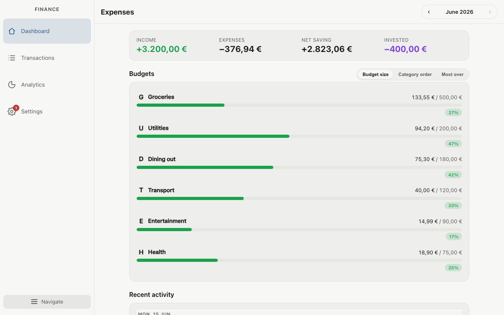
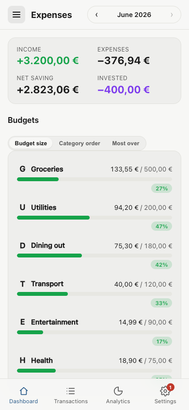
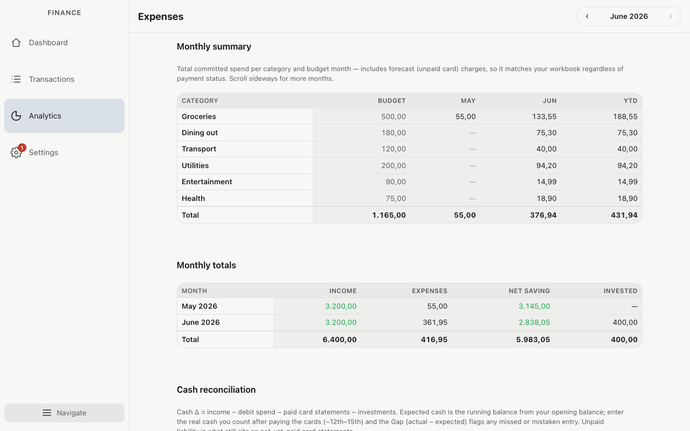
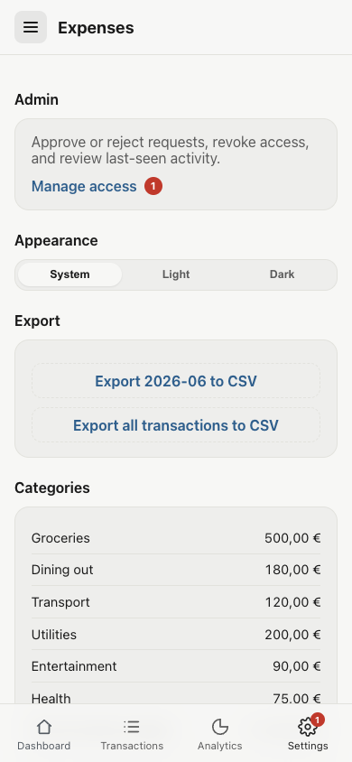
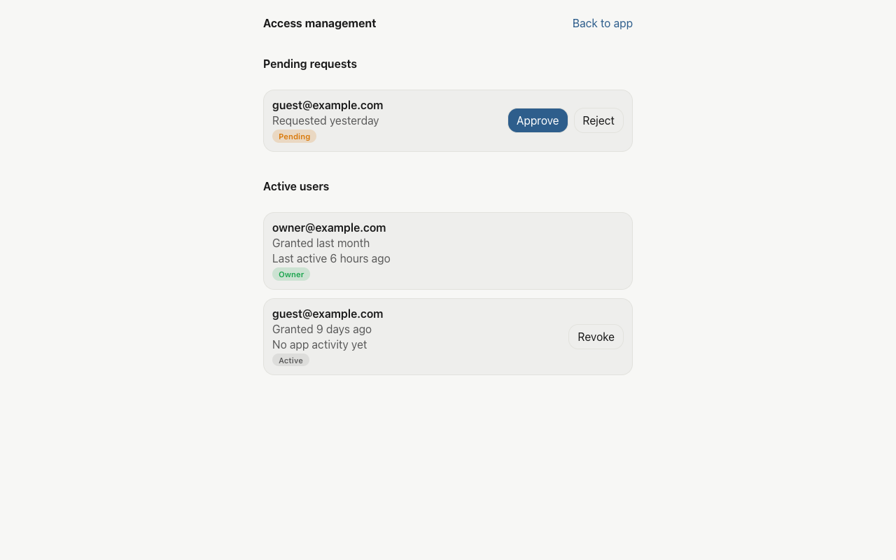
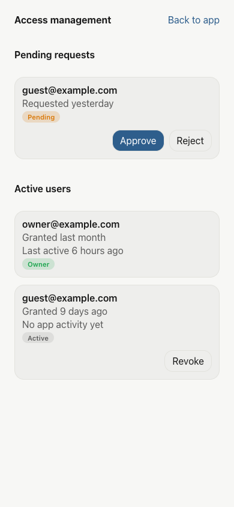

# Expense tracker

Personal budget and transaction tracker at **https://expenses.crivolotti.com**.

- **Cloudflare Access** (Google sign-in) — who can authenticate
- **D1 allowlist + in-app admin** — who can use the app (owner approves from `/access/admin`)
- **Row-level tenancy** — each user's data is scoped by email in D1

Shared UI: [`site-ui`](https://github.com/RoyCrivolotti/site-ui) (pinned in CI).

## Screenshots

Local dev with sample CSV data (`npm run dev`). Access admin shots use `DOCS_CAPTURE=1` mocks.

| Dashboard (desktop) | Dashboard (mobile) |
| --- | --- |
|  |  |

| Analytics (desktop) | Settings → Manage access (mobile) |
| --- | --- |
|  |  |

| Access admin (desktop) | Access admin (mobile) |
| --- | --- |
|  |  |

Regenerate: `npm run capture:screenshots` (installs Chromium via Playwright on first run).

## Local dev

```bash
# From ~/Repos/personal — link shared UI package first
./link-site-ui.sh && npm install
cd expense-tracker

cp config/access.example.json config/access.json   # set your owner email (gitignored)
cp config/allowed-emails.example.json config/allowed-emails.json   # optional bootstrap list

npm run dev   # CSV from finance-review when FINANCIAL_REVIEW_DIR is set
```

Dev mode loads **CSV data** (not D1). Production uses the API. `/access/admin` works in dev when the API is available, or with `DOCS_CAPTURE=1` mocks for docs.

## Config files (gitignored)

| File | Purpose |
| --- | --- |
| `config/access.json` | Your **owner email** for `npm run sync:access-env` (copied from `access.example.json`) |
| `config/allowed-emails.json` | One-time D1 bootstrap list for `npm run bootstrap:allowed-users` |
| `config/backup-alerts.json` | Optional backup alert recipients |
| `content/` | Local CSV copy from finance-review (never committed) |

CI uses GitHub secrets instead of these files (`OWNER_EMAIL`, `ALLOWED_EMAILS`, …).

## Verify & deploy

```bash
npm run verify
npm run sync:access-env      # push OWNER_EMAIL to Pages
npm run bootstrap:allowed-users   # seed D1 allowlist (when needed)
npm run deploy
```

**GitHub secrets:** `CLOUDFLARE_API_TOKEN`, `OWNER_EMAIL`, `ALLOWED_EMAILS`, `FINANCIAL_REVIEW_PAT`.

## Docs

- [docs/DEPLOYMENT.md](docs/DEPLOYMENT.md) — DNS, Access, D1, backups, CI
- [docs/PUBLIC_READINESS.md](docs/PUBLIC_READINESS.md) — before making the repo public
- [docs/HISTORY_REWRITE.md](docs/HISTORY_REWRITE.md) — git history hygiene

## License

Proprietary — see [LICENSE](./LICENSE). Source may be published for transparency; unauthorized use is prohibited.
