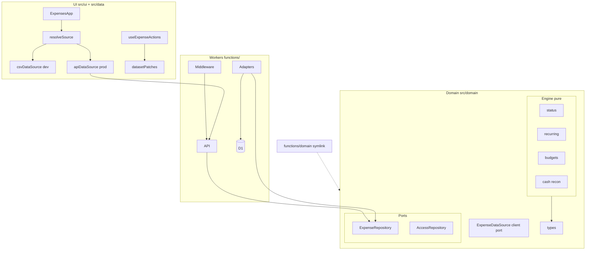

# expense-tracker — Fresh audit (23 June 2026)

Read-only multi-agent audit from scratch after recent cleanup (removed `sync-allowed-users`, gitignored `samples/` and `reports/`, reverted bank reconciliation scripts).

---

## Executive summary

| Dimension | **Jun 23** | Notes |
| --- | --- | --- |
| **Architecture / hexagonal** | **B+** | Pure engine + data-source swap; dual client/server ports, no application layer, procedural D1 modules |
| **API design** | **B+** | Thin handlers, strong access integration tests; expense routes thinly tested |
| **UI patterns (code)** | **B−** | folio-shell polish; minimal hook/component tests, dual mutation paths |
| **Tests (overall)** | **B** | Engine A, access B, expense API D+, UI C |
| **CI hygiene** | **B+** | `npm ci` + verify on PR/deploy; no cache, double verify on main |
| **Documentation** | **B** | DEPLOYMENT/TESTING strong; oncall group drift, RTL claims stale |
| **Security (private)** | **A−** | No secrets in git; row-level owner; samples/reports gitignored |
| **Repo hygiene** | **B+** | Clean scripts, zero eslint-disable; minor doc/path drift |
| **Product / UX** | **B−** | Strong deferred-card + cash recon niche; goals invisible, no import |

**Verdict:** Production-grade for its intended use (manual, workbook-faithful, deferred-card budgeting). Architecture is one notch below oncall-tracker on hexagonal purity but the domain engine is richer. Biggest product gap is **Goals configured but never shown**; biggest engineering gap is **expense API contract tests** and **shared client infra** (apiClient, params).

**Recommended next step:** Quick wins from oncall-tracker (`apiClient.ts`, `params.ts`, in-memory repo). Product: wire `computeGoals` to Dashboard or remove Goals from Settings until ready.

---

## Architecture (hexagonal)

### Layer compliance

| Check | Result |
| --- | --- |
| Engine imports only types + sibling engine | ✅ |
| UI never imports D1, `functions/`, or adapters | ✅ |
| `functions/domain` symlink = single source | ✅ (enforced in verify) |
| Application layer for orchestration | ❌ Handlers → repo directly |
| Parallel client/server persistence contracts | ⚠️ `ExpenseDataSource` vs `ExpenseRepository` |
| In-memory repo for port tests | ❌ (oncall has one) |

**Overall: B+** — genuine layering, incomplete hexagonal boundaries.

---

## API surface

| Route | Method | UI uses? | Notes |
| --- | --- | --- | --- |
| `/api/expenses` | GET | Yes | Monolithic dataset load |
| `/api/expenses/transactions` | POST | Yes | 201 on create |
| `/api/expenses/transactions/:id` | PATCH/DELETE | Yes | DELETE always 200 (no 404) |
| `/api/expenses/transactions/bulk` | DELETE | Yes | Body `{ ids }` |
| `/api/expenses/categories` | POST | Yes | 200 (not 201) |
| `/api/expenses/categories/:id` | PATCH | Yes | Soft-deactivate |
| `/api/expenses/accounts` | POST/PATCH | Yes | Same pattern |
| `/api/expenses/settings` | PUT | Yes | `defaultAccountId` not FK-validated |
| `/api/expenses/goals` | PUT | Yes | |
| `/api/expenses/statements` | PUT | Yes | RPC upsert |
| `/api/expenses/cash-actuals` | PUT | Yes | RPC upsert/clear |
| `/api/access/status` | GET | Yes | Groups from status |
| `/api/access/grants` | GET | **No** | Dead client method |
| `/api/access/*` admin | various | Yes | Owner-only in service layer |

**Dead routes: 0.** **Dead client methods: 1** (`fetchAccessGrants`).

---

## Test coverage matrix

| Layer | Grade | Files | CI? |
| --- | --- | --- | --- |
| Engine unit | **A** | 3 | Yes |
| Domain data + parity | **B** | 3 (+parity) | Yes (parity skips without CSV) |
| API — access | **B** | 1 integration | Yes |
| API — expenses | **D+** | 1 integration | Yes (auth/FK only) |
| Middleware | **B−** | 0 dedicated | Via access integration |
| _shared (backup, auth, db) | **A−** | 12 | Yes |
| UI / hooks | **C** | 5 | Yes (no `.test.tsx`) |
| Workers backup-cron | **F** | 0 | Indirect via backupService |

**CI today:** ~135 pass in CI (parity skips); 147 local with CSV (5 parity failures when workbook drifts).

---

## Product / UX (new dimension)

| Sub-grade | Grade | Notes |
| --- | --- | --- |
| Information architecture | **B−** | Four clear tabs; Settings overloaded |
| Visual design | **B+** | folio-shell cohesion; Analytics tables feel like Excel |
| Core workflows | **B** | Manual CRUD capable; budget month adds friction |
| Mobile UX | **B** | FAB, swipe-delete, collapsible filters |
| Feature completeness | **C+** | Deep cash recon; no import, goals invisible |
| Competitive fit | **C** | Strong for spreadsheet migrants; weak vs YNAB/Monarch |

**Differentiators:** deferred-card forecast, cash reconciliation, budget-month decoupling, description learning.

**Top UX gaps:** Goals never displayed; budget bars not tappable; no CSV import; card statements buried in Settings.

---

## Security & hygiene (private repo)

| Check | Status |
| --- | --- |
| Secrets in git | ✅ None |
| Real PII in tracked files | ✅ Clean (gitignored configs hold real emails locally) |
| `samples/`, `reports/` gitignored | ✅ (Jun 23 cleanup) |
| Auth: CF Access → allowlist → expenses group → owner | ✅ |
| Row-level owner on D1 reads/writes | ✅ |
| `defaultAccountId` FK validation | ⚠️ Missing server-side |
| Hub group enforcement | ⚠️ Client-side hide only |
| R2 backups on revoke | ⚠️ Not deleted |

**No security regressions from recent cleanup.**

---

## Documentation

| Doc | Grade | Notes |
| --- | --- | --- |
| README | **B+** | Screenshots, dev flow accurate; folio-shell version stale |
| DEPLOYMENT | **B** | Missing migration 0007, oncall group in admin copy |
| TESTING | **C+** | Claims RTL + `test:watch`; neither exists |
| PUBLIC_READINESS | **B** | Accurate; `@gmail.com` history check self-defeating |

---

## Findings (deduplicated)

Severity: **Critical** | **High** | **Medium** | **Low** | **Info**

### Critical

*None.*

### High

| ID | Finding | Paths |
| --- | --- | --- |
| H1 | Parity test fails locally when finance-review CSV present (workbook drift) | `src/domain/data/parseWorkbookCsv.parity.test.ts` |
| H2 | Expense API routes largely untested (accounts, categories, settings, goals, bulk) | `functions/api/expenses/**` |
| H3 | Goals editable in Settings but `computeGoals` never consumed in UI | `src/ui/`, `src/domain/engine/goals.ts` |
| H4 | Parallel persistence contracts — mutations need 4+ coordinated changes | `ExpenseDataSource`, `ExpenseRepository`, `apiDataSource`, adapter |
| H5 | Hook `.tsx` / component tests absent despite RTL in devDeps | `docs/TESTING.md`, `src/ui/` |

### Medium

| ID | Finding | Paths |
| --- | --- | --- |
| M1 | No `inMemoryExpenseRepository` — port tests mock raw D1 | cf. oncall `src/testing/` |
| M2 | `req()` duplicated in `apiDataSource` + `accessApi` | `src/data/` |
| M3 | `parseId` copy-pasted ×3 in route handlers | `functions/api/expenses/*/[id].ts` |
| M4 | Dual mutation paths: `useExpenseActions` vs `TransactionModal` | `src/ui/` |
| M5 | DELETE transaction always 200 even when zero rows deleted | `dbWrite.ts` |
| M6 | `defaultAccountId` not validated against owned accounts | `dbConfig.ts` |
| M7 | DEPLOYMENT omits oncall group + migration 0007 | `docs/DEPLOYMENT.md` |
| M8 | Access admin flows partially untested (reject, revoke, pending) | `functions/api/access/admin/` |
| M9 | Budget bars display-only — no drill-down to filtered transactions | `BudgetBar.tsx` |
| M10 | No CSV import UI (export only) | `src/ui/` |
| M11 | Card statement payment buried in Settings | `StatementToggles.tsx` |

### Low

| ID | Finding | Paths |
| --- | --- | --- |
| L1 | Dead client: `fetchAccessGrants` / `GET /api/access/grants` | `accessApi.ts` |
| L2 | Modal lacks focus trap (oncall fixed this) | `Modal.tsx` |
| L3 | Phase 1/Phase 2 stale comments in data sources | `csvDataSource.ts`, `apiDataSource.ts` |
| L4 | `samples/`, `reports/` gitignored but undocumented | `.gitignore` |
| L5 | Deploy runs verify + `npm ci` twice on main push | `.github/workflows/deploy.yml` |
| L6 | Duplicate month pickers on mobile Analytics | `MonthlySummaryMobile.tsx` |
| L7 | Delete uses `window.confirm` — no undo | `confirmDelete.ts` |
| L8 | ESLint ignores stale `private/content` path | `eslint.config.js` |

### Info

| ID | Finding |
| --- | --- |
| I1 | Pure domain engine is strongest layer (status, recurring, cash recon, goals) |
| I2 | Access integration tests are living spec for middleware + group grants |
| I3 | Optimistic `datasetPatches` keeps UI snappy |
| I4 | Deferred-card forecast is genuine product differentiator |
| I5 | Zero `eslint-disable` in source; size/complexity rules enforced |

---

## Comparison to oncall-tracker (Jun 23)

| Pattern | oncall-tracker | expense-tracker |
| --- | --- | --- |
| Overall architecture | A− | B+ |
| Application layer | ✅ | ❌ |
| Shared `apiClient` / `params` | ✅ | ❌ |
| In-memory test repo | ✅ | ❌ |
| Access integration tests | ✅ | ✅ |
| Expense/route contract tests | B+ | D+ |
| Product/UX audit | Not run | B− |
| CI (lockfile, npm ci) | A− | B+ |

---

## Recommended remediation order

### Quick wins (engineering)
1. Extract `src/data/apiClient.ts` + `functions/_shared/params.ts` (mirror oncall)
2. Fix TESTING.md drift; add or remove `test:watch`
3. Update DEPLOYMENT for oncall group + migration 0007
4. Parity test: opt-in via `PARITY_TESTS=1` so local verify stays green

### Structural (before major feature work)
1. Add `inMemoryExpenseRepository`
2. Expense API integration suite mirroring access pattern
3. Consolidate mutation paths through `useExpenseActions`
4. UI tests for `TransactionForm` + `useExpenseActions`

### Product (highest UX impact)
1. Wire `computeGoals` to Dashboard — or remove Goals from Settings
2. Tappable budget bars → filtered Transactions
3. CSV import (domain parser already exists)
4. Dashboard callout when unpaid card liability > 0

---

*Audit agents: architecture, API, tests/CI, docs/hygiene, security, product/UX.*
